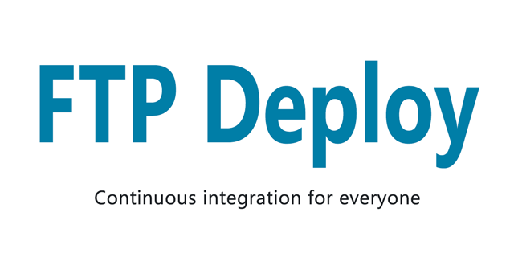

<p align="center">
  
</p>

Automate deploying websites and more with this GitHub action

 

---

### Usage Example

Place the following in `Your_Project/.github/workflows/main.yml`
```yml
on: push
name: Publish Website
jobs:
  FTP-Deploy-Action:
    name: FTP-Deploy-Action
    runs-on: ubuntu-latest
    steps:
    - uses: actions/checkout@v2.1.0
      with:
        fetch-depth: 2
    - name: FTP-Deploy-Action
      uses: SamKirkland/FTP-Deploy-Action@3.1.2
      with:
        ftp-server: ftp://ftp.samkirkland.com/
        ftp-username: myFtpUserName
        ftp-password: ${{ secrets.FTP_PASSWORD }}
```

---

### Setup Steps

1. Select the repository you want to add the action to
2. Select the `Actions` tab
3. Select `Blank workflow file` or `Set up a workflow yourself`, if you don't see these options manually create a yaml file `Your_Project/.github/workflows/main.yml`
4. Paste the example above into your yaml file and save
5. Now you need to add a key to the `secrets` section in your project. To add a `secret` go to the `Settings` tab in your project then select `Secrets`. Add a new `Secret` for `ftp-password`
6. Update your yaml file settings

__Note: Only tracked files will be published by default. If you want to publish files that don't exist in github (example: files generated during the action run) you must add those files/folders to `.git-ftp-include`__

Migrating from v2? See the [migration guide](v2-v3-migration.md)

---

### Settings


Keys can be added directly to your .yml config file or referenced from your project `Secrets` storage.

To add a `secret` go to the `Settings` tab in your project then select `Secrets`.
I recommend you store your `ftp-password` as a secret.

| Key Name       | Required? | Example                                    | Default | Description                                                                                                                                                                                                                                                       |
|----------------|-----------|--------------------------------------------|---------|-------------------------------------------------------------------------------------------------------------------------------------------------------------------------------------------------------------------------------------------------------------------|
| `ftp-server`   | Yes       | ftp://ftp.samkirkland.com/destinationPath/ |         | Deployment destination server & path. Formatted as `protocol://domain.com:port/destinationPath/` protocol can be `ftp`, `ftps`, or `sftp`. Port is optional, when not specified it will default to 21 when using ftp, 22 when using sftp, and 990 when using ftps |
| `ftp-username` | Yes       | username@samkirkland.com                   |         | FTP account username                                                                                                                                                                                                                                              |
| `ftp-password` | Yes       | CrazyUniquePassword&%123                   |         | FTP account password                                                                                                                                                                                                                                              |
| `local-dir`    | No        | deploy/                                    | ./      | Which local folder to deploy, path should be relative to the root and should include trailing slash. `./` is the root of the project                                                                                                                              |
| `git-ftp-args` | No        | See `git-ftp-args` section below           |         | Custom git-ftp arguments, this field is passed through directly into the git-ftp script                                                                                                                                                                           |
| `known-hosts`  | No        | hostname ssh-rsa AAAAB3NzaC1y ...          |         | The desired contents of your .ssh/known_hosts file. See [known hosts setup](#known-hosts-setup)                                                                                                                                                                   |

#### Advanced options using `git-ftp-args`
Custom arguments, this field is passed through directly into the git-ftp script. See [git-ftp's manual](https://github.com/git-ftp/git-ftp/blob/master/man/git-ftp.1.md) for all options.
You can use as many arguments as you want, seperate them with a space

Below is an incomplete list of commonly used args:

| Argument          | Description                                                                                                                                                                                                                           |
|-------------------|---------------------------------------------------------------------------------------------------------------------------------------------------------------------------------------------------------------------------------------|
| `--dry-run`       | Does not upload or delete anything, but tries to get the .git-ftp.log file from remote host                                                                                                                                           |
| `--silent`        | Be silent                                                                                                                                                                                                                             |
| `--all`           | Transfer all files, even seemingly the same as the target site (default is differences only). Note: Only files committed to github are uploaded, if you'd like to upload files generated during the action run see `.git-ftp-include` |
| `--lock`          | Locks remote files from being modified while a deployment is running                                                                                                                                                                  |
| `--remote-root`   | Specifies the remote root directory to deploy to. The remote path in the URL is ignored                                                                                                                                               |
| `--key`           | SSH private key file name for SFTP                                                                                                                                                                                                    |
| `--branch`        | Push a specific branch. I recommend [creating a yaml action for each branch instead](https://github.com/SamKirkland/FTP-Deploy-Action/issues/37#issuecomment-579819486)                                                               |
| `--pubkey`        | SSH public key file name. Used with `--key` option                                                                                                                                                                                    |
| `--insecure`      | Don't verify server's certificate                                                                                                                                                                                                     |
| `--cacert <file>` | Use as CA certificate store. Useful when a server has a self-signed certificate                                                                                                                                                       |

### Ignore specific files when deploying
Add patterns to `.git-ftp-ignore` and all matching file names will be ignored. The patterns are interpreted as shell glob patterns.
Here are some glob pattern examples:

#### Ignore git related files:
```gitattributes
.gitignore
*/.gitignore      # ignore files in sub directories
*/.gitkeep
.git-ftp-ignore
.git-ftp-include
.gitlab-ci.yml
```

#### Ignore a single file called `foobar.txt`
```gitattributes
foobar.txt
```

#### Ignore all files having extension .txt
```gitattributes
*.txt
```

#### Ignore everything in a directory named `config`
```gitattributes
config/*
```

### Force upload specific files
The `.git-ftp-include` file specifies intentionally untracked files to should upload. If you have a file that should always be uploaded, add a line beginning with `!` followed by the file's name.

#### Always upload the file `VERSION.txt`
```gitattributes
!VERSION.txt
```

#### Always upload the folder `build`
```gitattributes
!build/
```

If you have a file that should be uploaded whenever a tracked file changes, add a line beginning with the untracked file's name followed by a colon and the tracked file's name.
#### Upload CSS file compiled from an SCSS file
```gitattributes
css/style.css:scss/style.scss
```

If you have multiple source files, you can add multiple lines for each of them. Whenever one of the tracked files changes, the upload of the paired untracked file will be triggered.

```gitattributes
css/style.css:scss/style.scss
css/style.css:scss/mixins.scss
```

If a local untracked file is deleted, any change of a paired tracked file will trigger the deletion of the remote file on the server.

All paths are usually relative to the Git working directory. When using the `local-dir` option, paths of tracked files (right side of the colon) are relative to the set `local-dir`.
```gitattributes
# upload "html/style.css" triggered by html/style.scss
# with local-dir "html"
html/style.css:style.scss
```

If your source file is outside the `local-dir`, prefix it with a / and define a path relative to the Git working directory.
#### Uploading a file outside of `local-dir`
```gitattributes
# upload "dist/style.css" with local-dir "dist"
dist/style.css:/src/style.scss
```

It is also possible to upload whole directories. For example, if you use a package manager like composer, you can upload all vendor packages when the file composer.lock changes:
```gitattributes
vendor/:composer.lock
```
But keep in mind that this will upload all files in the vendor folder, even those that are on the server already. And it will not delete files from that directory if local files are deleted.

---

# Common Examples

Read more about the differences between these protocols [https://www.sftp.net/sftp-vs-ftps](https://www.sftp.net/sftp-vs-ftps)

### FTP (File Transfer Protocol)
`ftp://ftp.samkirkland.com:21/mypath`

FTP has existed since 1971, it's an ancient protocol with near universal support.

```yml
on: push
name: Publish Website
jobs:
  FTP-Deploy-Action:
    name: FTP-Deploy-Action
    runs-on: ubuntu-latest
    steps:
    - uses: actions/checkout@v2.1.0
      with:
        fetch-depth: 2
    - name: FTP-Deploy-Action
      uses: SamKirkland/FTP-Deploy-Action@3.1.2
      with:
        ftp-server: ftp://ftp.samkirkland.com/
        ftp-username: myFtpUserName
        ftp-password: ${{ secrets.FTP_PASSWORD }}
```

### FTPS (File Transfer Protocol over SSL)
`ftps://ftp.samkirkland.com:21/mypath`

Use the legacy FTP over a secure encrypted connection.

Notes about ftps:
- Most hosts don't offer FTPS, it's more common on windows/.net hosts and less common on linux hosting
- Most hosts don't have a correct certificate setup for ftp domains, [even my host doesn't do it right](https://ftp.samkirkland.com/). This means you'll likely have to add `--insecure` to `git-ftp-args`

```yml
on: push
name: Publish Website over FTPS
jobs:
  FTP-Deploy-Action:
    name: FTP-Deploy-Action
    runs-on: ubuntu-latest
    steps:
    - uses: actions/checkout@v2.1.0
      with:
        fetch-depth: 2

    - name: FTP-Deploy-Action
      uses: SamKirkland/FTP-Deploy-Action@3.1.2
      with:
        ftp-server: ftps://ftp.samkirkland.com:21/
        ftp-username: myFTPSUsername
        ftp-password: ${{ secrets.FTPS_PASSWORD }}
        git-ftp-args: --insecure # if your certificate is setup correctly this can be removed
```

### SFTP (SSH File Transfer Protocol)
`sftp://ftp.samkirkland.com:22/mypath`

Similar in name to FTP but this protocol is entirely new and requires SSH access to the server.

##### Notes about SFTP:
- **You CANNOT use a FTP account - they are not the same!**
- You must have shell access to your server, please read you webhosts documentation
- You will need to create a **SSH** user to deploy over SFTP. Normally this is your cpanel or hosting providers username and password
- Most web hosts change the default port (21), check with your host for your port number


### Known Hosts Setup
**Windows**  
In powershell run `ssh-keyscan -p <sshport> <hostname>` and copy the hash output  
Example for samkirkland.com `ssh-keyscan -p 7822 samkirkland.com`  


**Linux, or OSX (using homebrew)**  
Install the OpenSSH packages and use `ssh-keyscan <hostname>` and copy the hash output  

Add the `known-hosts` argument with your hosts hash   
Example: `knownhosts: ssh-rsa AAAAB3Nza...H1Q5Spw==`  

*Note: If you receive a `Connection refused` error, you must specify the ssh port to your host*  

```yml
on: push
name: Publish Website over SFTP
jobs:
  FTP-Deploy-Action:
    name: FTP-Deploy-Action
    runs-on: ubuntu-latest
    steps:
    - uses: actions/checkout@v2.1.0
      with:
        fetch-depth: 2

    - name: FTP-Deploy-Action
      uses: SamKirkland/FTP-Deploy-Action@3.1.2
      with:
        ftp-server: sftp://ftp.samkirkland.com:7280/
        ftp-username: mySFTPUsername
        ftp-password: ${{ secrets.SFTP_PASSWORD }}
        git-ftp-args: --insecure # if your certificate is setup correctly this can be removed (see known-hosts argument)
```

### Build and Publish React/Angular/Vue Website
Make sure you have an npm script named 'build'. This config should work for most node built websites.

> #### If you don't commit your `build` folder to github you MUST create a `.git-ftp-include` file with the content `!build/` so the folder is always uploaded!

```yml
on: push
name: Build and Publish Front End Framework Website
jobs:
  FTP-Deploy-Action:
    name: FTP-Deploy-Action
    runs-on: ubuntu-latest
    steps:
    - uses: actions/checkout@v2.1.0
      with:
        fetch-depth: 2

    - name: Use Node.js 16
      uses: actions/setup-node@v2
      with:
        node-version: '16'
        
    - name: Build Project
      run: |
        npm install
        npm run build --if-present
        
    - name: List output files
      run: ls
      
    - name: FTP-Deploy-Action
      uses: SamKirkland/FTP-Deploy-Action@3.1.2
      with:
        ftp-server: ftp://ftp.samkirkland.com/
        ftp-username: myFTPUsername
        ftp-password: ${{ secrets.FTP_PASSWORD }}
        local-dir: build # This folder is NOT going to upload by default unless you add it to .git-ftp-include
```

### Log only dry run: Use this mode for testing
Ouputs a list of files that will be created/modified to sync your source without making any actual changes
```yml
on: push
name: Publish Website Dry Run
jobs:
  FTP-Deploy-Action:
    name: FTP-Deploy-Action
    runs-on: ubuntu-latest
    steps:
    - uses: actions/checkout@v2.1.0
      with:
        fetch-depth: 2

    - name: FTP-Deploy-Action
      uses: SamKirkland/FTP-Deploy-Action@3.1.2
      with:
        ftp-server: ftp://ftp.samkirkland.com/
        ftp-username: myFTPUsername
        ftp-password: ${{ secrets.FTP_PASSWORD }}
        git-ftp-args: --dry-run
```

_Want another example? Let me know by creating a github issue_

---

## FAQ
<details>
  <summary>How to exclude .git files from the publish</summary>

See the [`.git-ftp-ignore`](#ignore-specific-files-when-deploying) example section
</details>

<details>
  <summary>All files are being uploaded instead of just different files</summary>

By default only different files are uploaded.

Verify you have `with: fetch-depth: 2` in your `actions/checkout@v2.1.0` step. The last 2 checkins are required in order to determine differences

If you've had multiple git commits without deploying, all files will be uploaded to get back in sync

Verify you **don't** have the `--all` git-ftp-args flag set
</details>

<details>
  <summary>How do I set a upload timeout?</summary>

github has a built-in `timeout-minutes` option, see customized example below

```yaml
on: push
name: Publish Website
jobs:
  FTP-Deploy-Action:
    name: FTP-Deploy-Action
    runs-on: ubuntu-latest
    timeout-minutes: 15 # time out after 15 minutes (default is 360 minutes)
    steps:
      ....
```
</details>

---

## Common Errors
<details id="failed-to-upload">
  <summary>Failed to upload files</summary>

  * **Fix 1:** Verify your login credentials are correct, download a ftp client and test with the exact same host/username/password
  * **Fix 2:** Remember if you are using SFTP or FTPS you cannot use a normal FTP account username/password. You must use a elevated account. Each host has a different process to setup a FTPS or SFTP account. Please contact your host for help.
  * **Fix 3:** If you are using sftp or ftps you should add `git-ftp-args: --insecure`, most hosts setup certificates incorrectly :(
</details>

<details id="cant-access-remote-sftp">
  <summary>Can't access remote 'sftp://', exiting...</summary>
  
  See ["Failed to upload files"](#failed-to-upload) section above
</details>

<details id="cant-access-remote-ftps">
  <summary>Can't access remote 'ftps://', exiting...</summary>
  
  See ["Failed to upload files"](#failed-to-upload) section above
</details>

<details id="files-arent_uploading">
  <summary>My files aren't uploading</summary>

  V3+ uses github to determine when files have changes and only publish differences. This means files that aren't committed to github will not upload by default.

  To change this behavior please see [`.git-ftp-ignore`](#ignore-specific-files-when-deploying) documentation.
</details>

<details id="prohibited-file-name">
  <summary>rm: Access failed: 553 Prohibited file name: ./.ftpquota</summary>

  The `.ftpquota` file is created by some FTP Servers and cannot be modified by the user

  Add `.ftpquota` to your [`.git-ftp-ignore`](#ignore-specific-files-when-deploying) file
</details>

<details id="ssl-peer-certificate">
  <summary>Error: SSL peer certificate or SSH remote key was not OK</summary>

  Whitelist your host via the `known-hosts` configuration option (see [known hosts setup](#known-hosts-setup) in SFTP) or add the `--insecure` argument
</details>

---

## Debugging locally
##### Instructions for debugging Windows
- [Install docker](https://docs.docker.com/get-docker/)  
- Open powershell **as Administrator**
- Install [act-cli](https://github.com/nektos/act#installation) by running `choco install act-cli`
- Navigate to the repo folder
- Run `npm install` - this will install all dependencies to build this project
- Run `npm build` - this will build the action javascript and watch/rebuild when files change
- Run `npm run build-docker` - this will build the docker container (only needs to be done once)
- Run `npm run run-docker` - this will spin up a local copy of the action defined in `/debug/local-debug-deployment.yaml`. Update package.json to set any secret values

#### Instructions for debugging on Linux
- [Install docker](https://docs.docker.com/get-docker/) on a Debian-based distro you can run `sudo apt install docker docker.io`
- Open the terminal
- Install [act-cli](https://github.com/nektos/act#installation)
- Navigate to the repo folder
- Run `npm install` - this will install all dependencies to build this project
- Run `npm build` - this will build the action javascript and watch/rebuild when files change
- Run `npm run build-docker` - this will build the docker container (only needs to be done once)
- Run `npm run run-docker` - this will spin up a local copy of the action defined in `/debug/local-debug-deployment.yaml`. Update package.json to set any secret values

#### Pull Requests Welcome!
