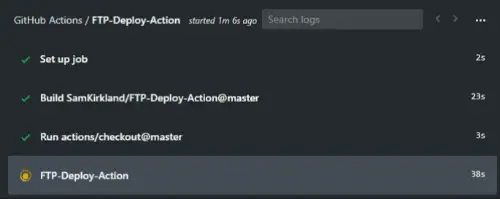

# FTP Deploy GitHub Action

Automate deploying websites and more with this GitHub action.



### Usage Example (Your_Project/.github/workflows/main.yml)
```yml
on: push
name: Publish Website
jobs:
  FTP-Deploy-Action:
    name: FTP-Deploy-Action
    runs-on: ubuntu-latest
    steps:
    - uses: actions/checkout@master
    - name: FTP-Deploy-Action
      uses: SamKirkland/FTP-Deploy-Action@2.0.0
      env:
        FTP_SERVER: ftp.samkirkland.com
        FTP_USERNAME: myFtpUserName
        FTP_PASSWORD: ${{ secrets.FTP_PASSWORD }}
        ARGS: --delete
        # --delete arg will delete files on the server if you've deleted them in git
```

1. Select the repository you want to add the action to
2. Select the actions tab `(currently only for beta testers)`
3. Select `Blank workflow file` or `Set up a workflow yourself`, if you don't see these options manually create a yaml file `Your_Project/.github/workflows/main.yml`
4. Paste the above code into your file and save
7. Now you need to add a key to the `secrets` section in your project. To add a `secret` go to the `Settings` tab in your project then select `Secrets`. Add a new `Secret` for `FTP_PASSWORD`

### Settings
Keys can be added directly to your .yml config file or referenced from your project `Secrets` storage.

To add a `secret` go to the `Settings` tab in your project then select `Secrets`.
I recommend you store your FTP_PASSWORD as a secret.

| Key Name       | Required? | Example                    | Default         | Description                                              |
|----------------|-----------|----------------------------|-----------------|----------------------------------------------------------|
| `FTP_SERVER`   | Yes       | ftp.samkirkland.com        | N/A             | FTP server name (you may need to specify a port)         |
| `FTP_USERNAME` | Yes       | git-action@samkirkland.com | N/A             | FTP account username                                     |
| `FTP_PASSWORD` | Yes       | CrazyUniquePassword&%123   | N/A             | FTP account password                                     |
| `METHOD`       | No        | ftp                        | ftp             | Protocol used to deploy (ftp or sftp)                    |
| `PORT`         | No        | 21                         | ftp=21, sftp=22 | The port used to connect to server                       |
| `LOCAL_DIR`    | No        | build                      | . (root project folder) | The local folder to copy, defaults to root project folder. Do NOT include slashes for folders. |
| `REMOTE_DIR`   | No        | serverFolder               | . (root FTP folder) | The remote folder to copy to, deafults to root FTP folder (I recommend you configure this on your server side instead of here). Do NOT include slashes for folders.  |
| `ARGS`         | No        | See `ARGS` section below   | N/A | Custom lftp arguments, this field is passed through directly into the lftp script. |

#### ARGS
Custom lftp arguments, this field is passed through directly into the lftp script. See [lftp's website](https://lftp.yar.ru/lftp-man.html) for all options.
You can use as many arguments as you want, seperate them with a space

Below is an incomplete list of commonly used ARGS:

| Argument               | Description                                                                                          |
|------------------------|------------------------------------------------------------------------------------------------------|
| `--verbose`            | Outputs which files are being modified, useful for debugging                                         |
| `--delete`             | Delete files not present at the source                                                               |
| `--transfer-all`       | Transfer  all  files, even seemingly the same as the target site                                     |
| `--dry-run`            | Ouputs files that will be modified without making any actual changes                                 |
| `--include=File.txt`   | Include matching files, you can add multiple `--include`                                             |
| `--exclude=File.txt`   | Exclude matching files, you can add multiple `--exclude`                                             |
| `--include-glob=*.zip` | Include matching files, you can add multiple `--include-glob`                                        |
| `--exclude-glob=*.zip` | Exclude matching files, you can add multiple `--exclude-glob`                                        |
| `--delete-excluded`    | Deletes any items you've marked as excluded if they exist on the server                              |
| `--no-empty-dirs`      | Don't create empty directories                                                                       |
| `--parallel=X`         | Uploads X files at a time in parallel                                                                |
| `-L`                   | Upload symbolic links as files (FTP doesn't have a way of creating actual symbolic links)            |


## Common Examples
### Build and Publish React/Angular/Vue/Node Website
Make sure you have an npm script named 'build'. This config should work for most node built websites
```yml
on: push
name: Build and Publish Front End Framework Website
jobs:
  FTP-Deploy-Action:
    name: FTP-Deploy-Action
    runs-on: ubuntu-latest
    steps:
    - uses: actions/checkout@master
    
    - name: Use Node.js 12.x
      uses: actions/setup-node@v1
      with:
        node-version: '12.x'
        
    - name: Build Project
      run: |
        npm install
        npm run build --if-present
        
    - name: List output files
      run: ls
      
    - name: FTP-Deploy-Action
      uses: SamKirkland/FTP-Deploy-Action@2.0.0
      env:
        FTP_SERVER: ftp.samkirkland.com
        FTP_USERNAME: myFTPUsername
        FTP_PASSWORD: ${{ secrets.FTP_PASSWORD }}
        LOCAL_DIR: build
        ARGS: --delete
```


## SFTP Example
```yml
on: push
name: Publish Website over SFTP
jobs:
  FTP-Deploy-Action:
    name: FTP-Deploy-Action
    runs-on: ubuntu-latest
    steps:
    - uses: actions/checkout@master
    
    - name: FTP-Deploy-Action
      uses: SamKirkland/FTP-Deploy-Action@2.0.0
      env:
        FTP_SERVER: ftp.samkirkland.com
        FTP_USERNAME: mySFTPUsername
        FTP_PASSWORD: ${{ secrets.FTP_PASSWORD }}
        METHOD: sftp
        PORT: 7280
        ARGS: --delete
```

### Log only dry run: Use this mode for testing
Ouputs a list of files that will be created/modified to sync your source without making any actual changes
```yml
on: push
name: Publish Website Dry Run
jobs:
  FTP-Deploy-Action:
    name: FTP-Deploy-Action
    runs-on: ubuntu-latest
    steps:
    - uses: actions/checkout@master
    - name: FTP-Deploy-Action
      uses: SamKirkland/FTP-Deploy-Action@2.0.0
      env:
        FTP_SERVER: ftp.samkirkland.com
        FTP_USERNAME: myFTPUsername
        FTP_PASSWORD: ${{ secrets.FTP_PASSWORD }}
        ARGS: --delete --dry-run
```

##### Want another example? Let me know by creating a github issue


## FAQ
1. `rm: Access failed: 553 Prohibited file name: ./.ftpquota`
   * The `.ftpquota` file is created by some FTP Servers and cannot be modified by the user
   * **Fix:** Add `--exclude=.ftpquota` to your ARGS
2. How to exclude .git files from the publish
   * **Fix:** Add `--exclude-glob=.git*/** --exclude-glob=.git**` to your ARGS
   * Note: If you've already published these files you will need to manually delete them on the server or add the `--delete-excluded` option to ARGS
   * Note: This will exclude all folders and files that start with `.git` no matter the folder they're in

#### Deprecated main.workflow config (used for beta/legacy apps that haven't been migrated to .yaml workflows yet)
```workflow
action "FTP-Deploy-Action" {
   uses = "SamKirkland/FTP-Deploy-Action@1.0.0"
   secrets = ["FTP_USERNAME", "FTP_PASSWORD", "FTP_SERVER"]
}
```

### Debugging locally
##### Instructions for debugging on windows
- Install docker for windows
- Open powershell
- Navigate to the repo folder
- Run `docker build --tag action .`
- (Optional) This step is only required when editing entrypoint.sh due to windows editors saving the file with windows line breaks instead of linux line breaks
  - Download http://dos2unix.sourceforge.net/
  - In another powershell window nagivate to the dos2unix folder /bin
  - Run this command every time you modify entrypoint.sh `.\dos2unix.exe "{FULL_PATH_TO_REPO\entrypoint.sh}"`
- Run `docker run action`
  
##### Instructions for debugging on linux
- Please submit a PR for linux instructions :)


#### ToDo
- More examples

#### Pull Requests Welcome!
