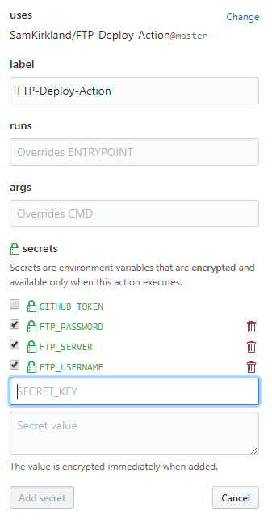

# FTP Deploy for GitHub Actions

Automate deploying websites and more with this GitHub action.


### Usage
```
action "FTP-Deploy-Action" {
   uses = "SamKirkland/FTP-Deploy-Action@master"
   secrets = ["FTP_USERNAME", "FTP_PASSWORD", "FTP_SERVER"]
}
```

1. Select the repository you want to add the action to
2. Select the actions tab `(currently only for beta testers)`
3. Select `Create a new workflow`
4. Select `Edit new file`
5. Paste the above code into the bottom of the file
6. Go back to the `Visual editor`
7. Click edit on the `FTP-Deploy-Action`
8. In the `secrets` section add the required params
   * FTP_USERNAME
   * FTP_PASSWORD
   * FTP_SERVER
   * (see optional settings below)

### Settings
- Options
   - __FTP Username__: ${FTP_USERNAME}
   - __FTP Password__: ${FTP_PASSWORD}
   - __FTP Server__: ${FTP_SERVER}
   - __(Optional) Local Dir__: ${LOCAL_DIR}
   - __(Optional) Remote Dir__: ${REMOTE_DIR}
- Set actions by editing the action then adding them in the `secrets` section:
  - 


### Explanation of steps
- This action is triggered by a `event` on your repo
- A docker image based on `mwienk/docker-lftp` is spun up on github servers
- The docker container compresses your code into a tar.gz file
- The file is then uploaded to the remote server
- The file is then un-zipped

### Debugging locally
###### Instructions for windows
- Install docker for windows
- Open powershell
- Navigate to the repo folder
- Run `docker build --tag action .`
- (Optional) This step is only required when editing entrypoint.sh due to windows editors saving the file with windows line breaks instead of linux line breaks
  - Download http://dos2unix.sourceforge.net/
  - In another powershell window nagivate to the dos2unix folder /bin
  - Run this command every time you modify entrypoint.sh `.\dos2unix.exe "{FULL_PATH_TO_REPO\entrypoint.sh}"`
- Run `docker run action`
  
###### Instructions for linux
- Please submit a PR for linux instructions :)


### ToDo
- More config options
   - Deploy Mode: ${DEPLOY_MODE} `full`|`diffs`
- SSH support
- Switch from lftp to git

Pull Requests Welcome!

### License
----

MIT
