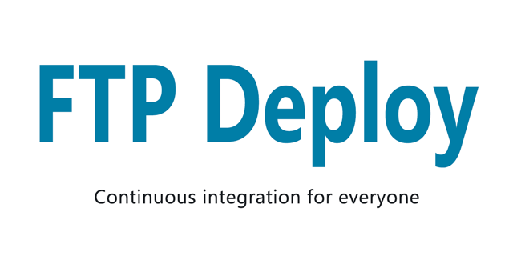

<p align="center">
  
</p>

Automate deploying websites and more with this GitHub action. **It's free!**


---

### Usage Example
Place the following in `/.github/workflows/main.yml`
```yml
on: push
name: 🚀 Deploy website on push
jobs:
  web-deploy:
    name: 🎉 Deploy
    runs-on: ubuntu-latest
    steps:
    - name: 🚚 Get latest code
      uses: actions/checkout@v2.3.2
    
    - name: 📂 Sync files
      uses: SamKirkland/FTP-Deploy-Action@4.0.0
      with:
        server: ftp.samkirkland.com
        username: myFtpUserName
        password: ${{ secrets.ftp_password }}
```

---

### Requirements
- You must have ftp access to your server. If your host requires ssh please use my web-deploy action (coming soon)
- Some web hosts change the default port (21), check with your host for your port number

---

### Setup Steps
1. Select the repository you want to add the action to
2. Select the `Actions` tab
3. Select `Blank workflow file` or `Set up a workflow yourself`, if you don't see these options manually create a yaml file `Your_Project/.github/workflows/main.yml`
4. Paste the example above into your yaml file and save
5. Now you need to add a key to the `secrets` section in your project. To add a `secret` go to the `Settings` tab in your project then select `Secrets`. Add a new `Secret` for `password`
6. Update your yaml file settings
7. If you appreciate this github action give it a :star: or show off with one of the [badges below](#badge).

---

### Settings
Keys can be added directly to your .yml config file or referenced from your project `Secrets` storage.

To add a `secret` go to the `Settings` tab in your project then select `Secrets`.
I strongly recommend you store your `password` as a secret.

| Key Name                | Required | Example                    | Default Value                                           | Description                                                                                                                                                        |
|-------------------------|----------|----------------------------|---------------------------------------------------------|--------------------------------------------------------------------------------------------------------------------------------------------------------------------|
| `server`                | Yes      | `ftp.samkirkland.com`      |                                                         | Deployment destination server                                                                                                                                      |
| `username`              | Yes      | `username@samkirkland.com` |                                                         | FTP user name                                                                                                                                                      |
| `password`              | Yes      | `CrazyUniquePassword&%123` |                                                         | FTP password, be sure to escape quotes and spaces                                                                                                                  |
| `port`                  | No       | `990`                      | `21`                                                    | Server port to connect to (read your web hosts docs)                                                                                                               |
| `protocol`              | No       | `ftps`                     | `ftp`                                                   | `ftp`: provides no encryption, `ftps`: full encryption newest standard (aka "explicit" ftps), `ftps-legacy`: full encryption legacy standard (aka "implicit" ftps) |
| `local-dir`             | No       | `./myFolderToPublish/`     | `./`                                                    | Folder to upload from, must end with trailing slash `/`                                                                                                  |
| `server-dir`            | No       | `public_html/www/`         | `./`                                                    | Folder to upload to (on the server), must end with trailing slash `/`                                                                                                            |
| `state-name`            | No       | `folder/.sync-state.json`  | `.ftp-deploy-sync-state.json`                           | Path and name of the state file - this file is used to track which files have been deployed                                                                        |
| `dry-run`               | No       | `true`                     | `false`                                                 | Prints which modifications will be made with current config options, but doesn't actually make any changes                                                         |
| `dangerous-clean-slate` | No       | `true`                     | `false`                                                 | Deletes ALL contents of server-dir, even items in excluded with 'exclude' argument                                                                                 |
| `exclude`               | No       |                            | `.git*` `.git*/**` `node_modules/**` `node_modules/**/*` | An array of glob patterns, these files will not be included in the publish/delete process. [List must be in yaml array format](#exclude-files)                                                                          |
| `log-level`             | No       | `minimal`                  | `standard`                                              | `minimal`: only important info, `standard`: important info and basic file changes, `verbose`: print everything the script is doing                                 |
| `security`              | No       | `strict`                   | `loose`                                                 | `strict`: Reject any connection which is not authorized with the list of supplied CAs. `loose`: Allow connection even when the domain is not certificate           |


# Common Examples
#### Build and Publish React/Angular/Vue Website
Make sure you have an npm script named 'build'. This config should work for most node built websites.

```yml
on: push
name: 🚀 Deploy website on push
jobs:
  web-deploy:
    name: 🎉 Deploy
    runs-on: ubuntu-latest
    steps:
    - name: 🚚 Get latest code
      uses: actions/checkout@v2.3.2

    - name: Use Node.js 12
      uses: actions/setup-node@v2-beta
      with:
        node-version: '12'
      
    - name: 🔨 Build Project
      run: |
        npm install
        npm run build
    
    - name: 📂 Sync files
      uses: SamKirkland/FTP-Deploy-Action@4.0.0
      with:
        server: ftp.samkirkland.com
        username: myFtpUserName
        password: ${{ secrets.password }}
```

#### FTPS
```yml
on: push
name: 🚀 Deploy website on push
jobs:
  web-deploy:
    name: 🎉 Deploy
    runs-on: ubuntu-latest
    steps:
    - name: 🚚 Get latest code
      uses: actions/checkout@v2.3.2

    - name: 📂 Sync files
      uses: SamKirkland/FTP-Deploy-Action@4.0.0
      with:
        server: ftp.samkirkland.com
        username: myFtpUserName
        password: ${{ secrets.password }}
        protocol: ftps
        port: 1234 # todo replace with your web hosts ftps port
```

#### Log only dry run: Use this mode for testing
Ouputs a list of files that will be created/modified to sync your source without making any actual changes
```yml
on: push
name: 🚀 Deploy website on push
jobs:
  web-deploy:
    name: 🎉 Deploy
    runs-on: ubuntu-latest
    steps:
    - name: 🚚 Get latest code
      uses: actions/checkout@v2.3.2

    - name: 📂 Sync files
      uses: SamKirkland/FTP-Deploy-Action@4.0.0
      with:
        server: ftp.samkirkland.com
        username: myFtpUserName
        password: ${{ secrets.password }}
        dry-run: true
```

#### Exclude files
Excludes files
```yml
on: push
name: 🚀 Deploy website on push
jobs:
  web-deploy:
    name: 🎉 Deploy
    runs-on: ubuntu-latest
    steps:
    - name: 🚚 Get latest code
      uses: actions/checkout@v2.3.2

    - name: 📂 Sync files
      uses: SamKirkland/FTP-Deploy-Action@4.0.0
      with:
        server: ftp.samkirkland.com
        username: myFtpUserName
        password: ${{ secrets.password }}
        exclude: .git*
          - .git*/**
          -  **/.git*/**
          - node_modules/**
          - node_modules/**/*
```

_Want another example? Let me know by creating a [github issue](https://github.com/SamKirkland/FTP-Deploy-Action/issues/new)_

---

## Badge

If you appreciate this github action give it a :star: or show off with one of the badges below. Feel free to edit the text or color.

[](https://github.com/SamKirkland/FTP-Deploy-Action)

```md
[](https://github.com/SamKirkland/FTP-Deploy-Action)
```

[](https://github.com/SamKirkland/FTP-Deploy-Action)

```md
[](https://github.com/SamKirkland/FTP-Deploy-Action)
```

[](https://github.com/SamKirkland/FTP-Deploy-Action)

```md
[](https://github.com/SamKirkland/FTP-Deploy-Action)
```

---

[](https://github.com/SamKirkland/FTP-Deploy-Action)

```md
[](https://github.com/SamKirkland/FTP-Deploy-Action)
```

[](https://github.com/SamKirkland/FTP-Deploy-Action)

```md
[](https://github.com/SamKirkland/FTP-Deploy-Action)
```

[](https://github.com/SamKirkland/FTP-Deploy-Action)

```md
[](https://github.com/SamKirkland/FTP-Deploy-Action)
```

---

## FAQ
<details>
  <summary>How to exclude .git files from the publish</summary>

Git files are excluded by default! If you customize the `exclude` option make sure you re-add the default options.
</details>

<details>
  <summary>How to exclude a specific file or folder</summary>

You can use the `exclude` option to ignore specific files/folders from the publish. Keep in mind you will need to re-add the default exclude options if you want to keep them. For example the below option excludes all `.txt` files.

```yml
exclude: '*.txt'
```

</details>


<details>
  <summary>How do I set a upload timeout?</summary>

github has a built-in `timeout-minutes` option, see customized example below

```yaml
on: push
name: Publish Website
jobs:
  web-deploy:
    name: web-deploy
    runs-on: ubuntu-latest
    timeout-minutes: 15 # time out after 15 minutes (default is 360 minutes)
    steps:
      ....
```
</details>

## Debugging your config locally
This action is a basic wrapper around my `@samkirkland/ftp-deploy` npm package. To test your config you can install [@samkirkland/ftp-deploy](https://github.com/SamKirkland/ftp-deploy) and then convert your config to a yml action. Settings are one-to-one, this action is only a wrapper.

## Contributing to this project
To test this action locally you will need to setup **docker** and **act** to run a environment similar to the one github uses for actions.
- Download/install docker for windows, make sure it is running
- `choco install act-cli` install [act](https://github.com/nektos/act)
- Install the npm package using `npm install --dev-only @samkirkland/ftp-deploy`
- Update the `deploy` script in `package.json` with a actual server/username/password
- You can run the script using the following command `npm run deploy` (run this in the folder that has the `package.json` file)
